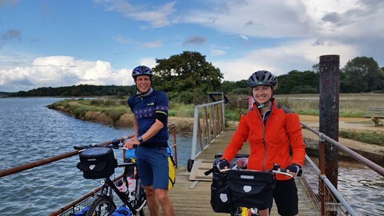

Welcome to Read Cycle Read! 

After months of deliberation, compromises and many a pro/con list we have decided to head back to New Zealand this year (2018). It's a long way, and a rapid transition if taking the standard 24 hour flight. So to slow things down we've decided to make our journey by bike, a chance to see the world in slow-mo and immerse ourselves in foreign cultures along the way.

We'll be supporting and raising funds for the [**World Land Trust**](http://www.worldlandtrust.org/) as we go. The WLT is an international conservation charity, which protects the world’s most biologically important and threatened habitats, in particular by developing partnerships with local individuals, communities and organisations. We hope to visit some of their projects along the way. 

For more information and to donate please visit our JustGiving page: 
[**justgiving.com/fundraising/readcycleread**](https://www.justgiving.com/fundraising/readcycleread)

We'll try and update the blog every few weeks, or follow us on [**Instagram**](https://www.instagram.com/readcycleread/) (@readcycleread) or [**Strava**](https://www.strava.com/athletes/readcycleread) for more regular updates.

We'd love to hear from you all!
