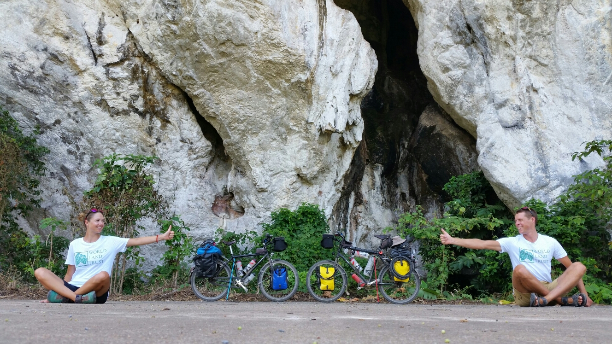

Welcome to Read Cycle Read! 

After months of deliberation, compromises and many a pro/con list we have decided to move from London to New Zealand. It's a long way, and a rapid transition if taking the standard 24 hour flight. So to slow things down we've decided to make our journey by bicyle - a chance to see the world in slow-mo and immerse ourselves in foreign cultures along the way.  

You can read about our adventures on the [**Blog**](http://readcycleread.bike/pages/blog/index.html) and check out our [**Route**](http://readcycleread.bike/pages/map.html) page to see exactly where we cycled.  

  

We are supporting and raising funds for the [**World Land Trust**](http://www.worldlandtrust.org/) as we go. The WLT is an international conservation charity, which protects the world’s most biologically important and threatened habitats, in particular by developing partnerships with local individuals, communities and organisations. We will be visiting some of their projects along the way. 

We are are aiming to raise £1 per mile ridden (£10,000)...  

As of February 2019 we've cycled 9320 miles / 15000 kms through 24 countries and raised £4,000 - thank you!  

For more information and to donate please visit our JustGiving page: 
[**justgiving.com/fundraising/readcycleread**](https://www.justgiving.com/fundraising/readcycleread)

We'll try and update the blog here every few weeks as Internet connections permit, or follow us on [**Instagram**](https://www.instagram.com/readcycleread/) (@readcycleread) or [**Strava**](https://www.strava.com/athletes/readcycleread) for more regular updates.

Please feel free to get in touch - we'd love to hear from you!
